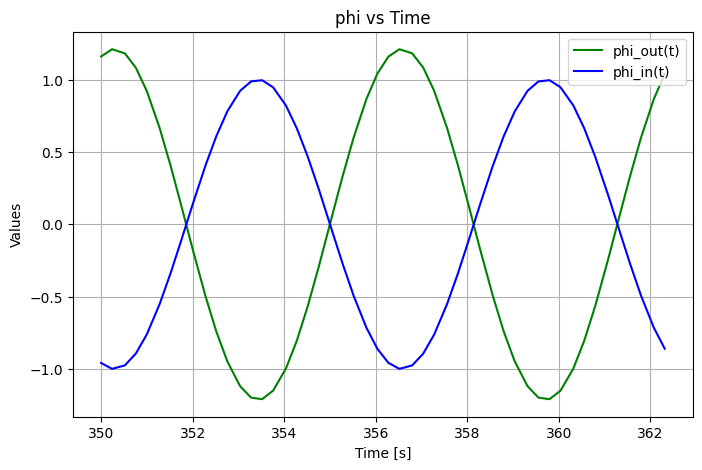

## Initial Simulation Results

#### $\phi$ vs. time

C = 1/50    # Capacitance  
Z = 800   # Impedance  
L_0 = 50    # Base inductance  
L_p = 0.6  # Amplitude of inductance oscillation  
omega = 1.0 # Frequency for the sinusoidal functions

#### FFT Recipe

$\phi_{out}$ signal will comprise of two frequencies- $\omega$ and $2 \omega$.`

Here I will follow the following steps to extract the $\omega$ component from the signal:

1. Extract a portion (typically 2/3 periods) of the $\phi_{out}$ signal where the system has reached equillibrium oscillations.
2. Pick time values corresponding to $\omega$ as follows:

$$

T = n\frac{2\pi}{\omega}, \quad \Delta t = T/N

$$
where $n$ is the number of periods wanted, $\Delta t$ is the step size and $N$ is the number of divisions.  
3. Calculate the modified $\phi_{out}$ at these time points.

#### $\phi$ vs. time (modified)

#### Power Spectrum

#### Gain vs. Frequency

Gain calculated from theory: 1.4698  
Gain calculated from FFT: 1.4696