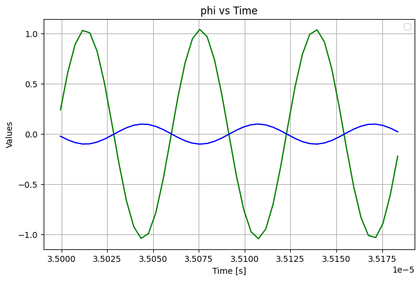
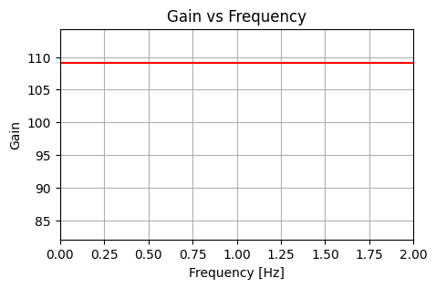

## Sensitivity Analysis of Gain w.r.t. $L_p$ 

First, let's pick a set of realistic parameters for the following:  
$A_{in}$ = 0.1      # Amplitude of the input signal 0.1 V  
$C$ = 10e-9       # Capacitance 10 nF  
$Z$ = 50          # Impedance 50 Ohm  
$L_0$ = 10e-9     # Base inductance 10 nH  
$\omega$ = 100e6   # Frequency for the sinusoidal functions 100 MHz

**Plotting Gain vs. $L_p$:**

A singularity is shown at 0.4 nH

**Zooming in around 0.39 nH:**

## Simulation with chosen Params

**Choosing L_p as 0.33 nH, we get a gain (calculated from theory) of ~108**

**Resampled $\phi$ vs. $t$ for FFT**

**Power spectrum**

**Gain vs. Frequency**

Gain from theory: 108.7551  
Gain from FFT: 109.1138  
*This discrepancy of 0.36 might be due to the sampling rate used in the FFT recipe.